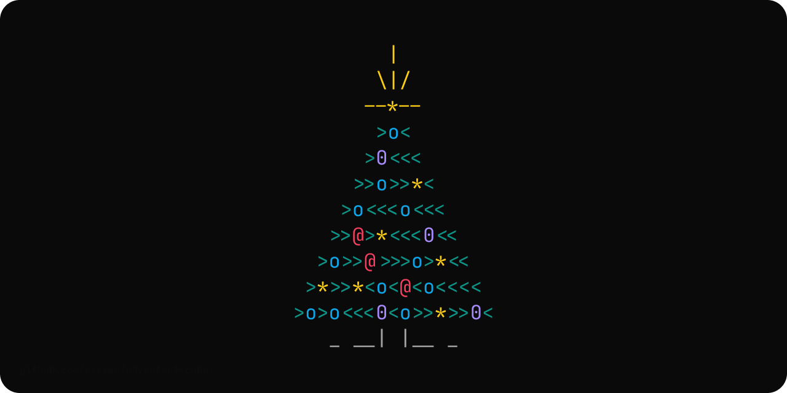

# Advent of Code

Solutions for the annual programming competition "Advent of Code"

# Efficiency

All the benchmarks were executed on the MacBook Air M1.

The way I check the efficiency of the solutions:

```sh
cd go
go test -bench=. -count=10 ./... > bench.txt
benchstat bench.txt
```

## 2023

| Go                              | Part One | Part Two |
| ------------------------------- | -------- | -------- |
| [day 01](./go/2023/01/day01.go) | `28 µs`  | `40 μs`  |
| [day 02](./go/2023/02/day02.go) | `6.5 µs` | `8.5 μs` |
| [day 03](./go/2023/03/day03.go) | `92 µs`  | `92 μs`  |
| [day 04](./go/2023/04/day04.go) | `44 µs`  | `46 μs`  |
| [day 05](./go/2023/05/day05.go) | `23 µs`  | `42 μs`  |
| [day 06](./go/2023/06/day06.go) | `0.4 µs` | `0.4 μs` |